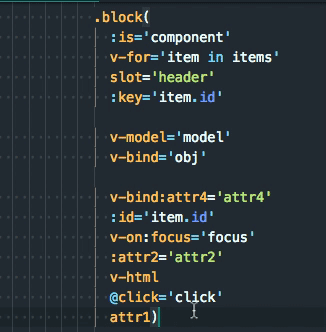

## Features

"Vue sort attributes" helps you to sort attributes according to the [recommendations of Vue style guide](https://vuejs.org/v2/style-guide/#Element-attribute-order-recommended)

| Command | Title | Comments
|---|---|---|
| VueAttrSort.sort | Vue sort attributes | Keybound to `ctrl+k ctrl+k`

## WARNING:
This plugin sorts line by line. It doesn't parse the html-tree, doesn't build ast and so on, that's why it can sometimes be buggy. I'm going to implement this, but I don't have a time right now... :) 
